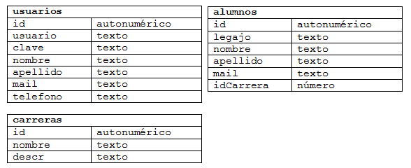

.. -*- coding: utf-8 -*-

.. _rcs_subversion:

Clase 15 - POO 2020
===================
(Fecha: 6 de mayo)

Polimorfismo
^^^^^^^^^^^^

- Lo utilizamos con punteros.
- Nos permite acceder a objetos de la clase derivada usando un puntero a la clase base.
- Sin embargo, sólo podemos acceder a datos y funciones que existan en la clase base.
- Los datos y funciones propias de la derivada quedan inaccesibles.

.. code-block:: c

	class Persona  {
	public:
	    Persona(QString nombre) : nombre(nombre)  {  }
	    QString verNombre()  {  return "Nombre: " + nombre;  }

	protected:  // Para acceso desde las clases derivadas
	    QString nombre;
	};

	class Empleado : public Persona  {
	public:
	    Empleado( QString nombre ) : Persona( nombre )  {  }
	    QString verNombre()  {  return "Empleado: " + nombre;  }
	    void mostrarAlgo()  {  qDebug() << "Algo";  }
	};

	class Estudiante : public Persona  {
	public:
	    Estudiante( QString nombre ) : Persona( nombre )  {  }
	    QString verNombre()  {  return "Estudiante: " + nombre;  }
	};

	#include <QApplication>
	#include "personal.h"
	#include <QDebug>

	int main( int argc, char** argv )  {
	    QApplication a(argc, argv);

	    {
	    Persona * jose = new Estudiante( "Jose" );
	    Persona * carlos = new Empleado( "Carlos" );

	    qDebug() << carlos->verNombre();
	    qDebug() << jose->verNombre();
	    carlos->mostrarAlgo();  // Muestra algo? 

	    delete jose;
	    delete carlos;
	    }

	    return a.exec();
	}
	

Conexión a base de datos
^^^^^^^^^^^^^^^^^^^^^^^^

**Ejemplo de la estructura de las tablas en la base de datos**

- Con Qt se pueden utilizar los siguientes motores de base de datos:
	- **ODBC (Open DataBase Connectivity)**: 
		- Estándar de acceso a base de datos
		- Usado con Microsoft Access en Windows
		- Está disponible en Windows: Panel de control -> Herramientas administrativas -> ODBC Data sources
			
	- **SQLite**
		- Es un sistema de gestión de bases de datos relacional.
		- En C y libre
		- Los datos se almacenan en un archivo
		- No es cliente-servidor. La librería (dll) tiene funciones para trabajar
		- No requiere instalación, directamente con un ejecutable
		- Para Linux, Windows, Mac OS, Android, iOS, BlackBerry OS, Windows Phone, ...
		- Algunas aplicaciones que usan SQLite: Skype, Firefox, Photoshop, ...
			
	- **MySQL**
		- Quizás el motor de base de datos más utilizado
		- Usado por los más grandes: Facebook, Twitter, YouTube, Wikipedia, ...
		- Requiere una instalación más avanzada para usar con Qt dependiendo el SO que se utilice.
		
Usando SQLite
^^^^^^^^^^^^^

**Creación de una base de datos SQLite**
	
- Descargar de http://www.sqlite.org/download.html
- Precompiled Binaries for Windows–Linux–MAC (The command-line shell program)
- En Linux se puede hacer: ``sudo apt-get install sqlite3``
- Al descomprimir tenemos el ejecutable sqlite3
- Creamos una carpeta C:/Qt/db (o /home/db) y copiamos ahí el ejecutable
- En consola creamos una base de datos, por ejemplo, llamada ``test`` con una tabla ``usuarios``

::

	sqlite3 test

	create table usuarios (
	    id integer primary key,  (es autoincrementable)
	    usuario varchar(30),
	    clave varchar(30),
	    nombre varchar(50),
	    apellido varchar(50),
	    mail varchar(50)
	);

	// Podemos insertar un registro 

	insert into usuarios (usuario, clave,	nombre, apellido, mail) 
	values ("cgomez", "1234", "Carlos", "Gomez", "cgomez@gmail.com");

	// Podemos ver el contenido de la tabla "usuario":

	select * from usuarios;

	// Para salir de la base:
		
	.exit

En Qt	
^^^^^

- Requiere QT += sql
- Para averiguar los controladores disponibles, usamos el método estático:

.. code-block:: c

	qDebug() << QSqlDatabase::drivers();  // Devuelve un QStringList

- Un objeto QSqlDatabase representa la conexión a la base
- Elegimos el controlador y conectamos:

.. code-block:: c

	QSqlDatabase db = QSqlDatabase::addDatabase("QSQLITE");

	db.setDatabaseName("C:/Qt/db/test"); 
	if (db.open())
	    qDebug() << "Conexión exitosa";
	else
	    qDebug() << "No se pudo abrir la base";

- En Windows, para usar el archivo Access ``C:/db/base.mdb`` se hace lo siguiente:
	
.. code-block:: c
		
	QSqlDatabase db = QSqlDatabase::addDatabase("QODBC");

	db.setDatabaseName("DRIVER={Microsoft Access Driver (*.mdb, *.accdb)};"
	                   "DBQ=C:/db/base.mdb"); 
	if (db.open())
		qDebug() << "Conexión exitosa";

**Preparando la clase AdminDB**

- Definir una clase AdminDB para administrar la base de datos
- Crear el siguiente método:

.. code-block:: c
	
	bool conectar(QString archivoSqlite); 

- En un proyecto nuevo y desde la función main() intentar la conexión.

.. code-block:: c

	// --- adminDB.h ---------------
	#include <QSqlDatabase>
	#include <QString>
	#include <QObject>

	class AdminDB : public QObject  {
	    Q_OBJECT

	public:
	    AdminDB();
	    bool conectar(QString archivoSqlite);
	    QSqlDatabase getDB();

	private:
	    QSqlDatabase db;
	};

	// --- adminDB.cpp ------------
	#include "adminDB.h"

	AdminDB::AdminDB()  {
	    db = QSqlDatabase::addDatabase("QSQLITE");
	}

	bool AdminDB::conectar(QString archivoSqlite)  {
	    db.setDatabaseName(archivoSqlite);

	    if(db.open())
	        return true;

	    return false;
	}

	QSqlDatabase AdminDB::getDB()  {
	    return db;
	}

	// --- main.cpp  ----------------
	#include <QApplication>
	#include "adminDB.h"

	int main(int argc, char** argv)  {
	    QApplication a(argc, argv);

	    qDebug() << QDir::currentPath();

	    AdminDB adminDB;
	    if (adminDB.conectar("C:/Qt/db/test"))
	        qDebug() << "Conexion exitosa";
	    else
	        qDebug() << "Conexion NO exitosa";

	return 0;
	}

Consulta a la base de datos
^^^^^^^^^^^^^^^^^^^^^^^^^^^

.. code-block:: c

	QSqlDatabase db = QSqlDatabase::addDatabase("QSQLITE");

	db.setDatabaseName("C:/Qt/db/test"); 

	if (db.open())  {
	    QSqlQuery query = db.exec("SELECT nombre, apellido FROM usuarios");

	    while(query.next())  {
	        qDebug() << query.value(0).toString() << " " << query.value(1).toString();
	    }
	}

	

**Ejemplo**: slot de la clase Login para que valide usuarios contra la base

.. code-block:: c

	void Login::slot_validar()  {
	    bool usuarioValido = false;

	    if (adminDB->getDB().isOpen())  {  
	        QSqlQuery* query = new QSqlQuery(adminDB->getDB());

	        query->exec("SELECT nombre, apellido FROM usuarios WHERE usuario='" + 
	        leUsuario->text() + "' AND clave='" + leClave->text() + "'");

	        // Si los datos son consistentes, devolverá un único registro.
	        while (query->next())  {

	            QSqlRecord record = query->record();

	            // Obtenemos el número de la columna de los datos que necesitamos.
	            int columnaNombre = record.indexOf("nombre");
	            int columnaApellido = record.indexOf("apellido");

	            // Obtenemos los valores de las columnas.
	            qDebug() << "Nombre=" << query->value(columnaNombre).toString();
	            qDebug() << "Apellido=" << query->value(columnaApellido).toString();

	            usuarioValido = true;
	        }

	        if (usuarioValido)  {
	            QMessageBox::information(this, "Conexión exitosa", "Válido");
	        }
	        else  {
	            QMessageBox::critical(this, "Sin permisos", "Usuario inválido");
	        }
	    }
	}

Clase QCryptographicHash
^^^^^^^^^^^^^^^^^^^^^^^^

- Provee la generación de la clave hash 
- Soporta MD5, MD4 y SHA-1

.. code-block:: c

	enum Algorithm { Md4, Md5, Sha1 }

	QCryptographicHash(Algorithm metodo)

	void addData(const QByteArray & data)
	
	void reset()

	QByteArray result() const

**Método estático**

.. code-block:: c

	QByteArray hash( const QByteArray & data, Algorithm metodo )

**Otros métodos útiles**

.. code-block:: c

	QByteArray QByteArray::toHex()
	// Devuelve en hexadecimal
	// Útil para enviar por url una clave hash MD5
	// Hexadecimal tiene sólo caracteres válidos para URL

**Ejemplo**: Obtener MD5 de la clave ingresada en un QlineEdit:

.. code-block:: c

	QcryptographicHash::hash( leClave->text().toUtf8(), QCryptographicHash::Md5 ).toHex()
	

**Calculadora MD5 online**

http://md5calculator.chromefans.org/?langid=es

**Ejercicio 10**

- En el pizarrón se escribió el siguiente método para la clase AdminDB.
- Se pide implementarlo en un proyyecto que tenga un login y valide los usuarios contra la base de datos.
- La clave debe estar en MD5.
- Hacer los cambios necesarios en este método para su funcionalidad correcta.

.. code-block:: c	
	
	/**
	 * Si el usuario y clave son crrectas, este metodo devuelve el nombre y 
	 * apellido en un QStringList.	           
	 */
	QStringList AdminDB::validarUsuario( QString tabla,	QString usuario, QString clave )  {

	    QStringList datosPersonales;

	    if ( ! db.isOpen() ) 
	        return datosPersonales;

	    QSqlQuery * query = new QSqlQuery( db );
	    QString claveMd5 = QCryptographicHash::hash( claveMd5.toUtf8(), 
	                                                 QCryptographicHash::Md5 ).toHex();

	    query->exec( "SELECT nombre, apellido FROM " +
	                 tabla + " WHERE usuario = '" + usuario +
	                 "' AND clave = '" + claveMd5 + "'" );
	
	    while( query->next() )  {
	        QSqlRecord registro = query->record();

	        datosPersonales << query->value( registro.indexOf( "nombre" ).toString() );
	        datosPersonales << query->value( registro.indexOf( "apellido" ).toString() );
	    }

	    return datosPersonales;
	} 

**Ejercicio 11**

- Crear el siguiente método dentro de la clase AdminDB:

.. code-block:: c	
	
	/**
	 * @brief Método que ejecuta una consulta SQL a la base de datos que ya se encuentra conectado. 
	          Utiliza QSqlQuery para ejecutar la consulta, con el método next() se van extrayendo 
	          los registros que pueden ser analizados con QSqlRecord para conocer la cantidad de 
	          campos por registro.
	 * @param comando es una consulta como la siguiente: SELECT nombre, apellido, id FROM usuarios
	 * @return Devuelve un QVector donde cada elemento es un registro, donde cada uno de estos registros 
	           están almacenados en un QStringList que contiene cada campo de cada registro.	           
	 */
	QVector<QStringList> select(QString comando); 

