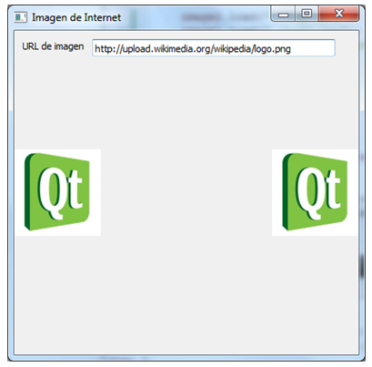

.. -*- coding: utf-8 -*-

.. _rcs_subversion:

Clase 16 - POO 2019
===================
(Fecha: 17 de mayo)

Uso de Qt Designer
..................

- Nuevo proyecto -> Qt GUI Application
- Utilizar el puntero ``ui`` para acceder a los objetos del diseño
- Tener en cuenta que los métodos virtuales de QWidget para eventos se pueden usar:

.. code-block:: c	

	virtual void mousePressEvent( QMouseEvent * event );
	virtual void resizeEvent( QResizeEvent * event );
	virtual void moveEvent( QMoveEvent * event );
	...

**Ejemplo**

.. code-block:: c	
	
	// ventana.h
	#ifndef VENTANA_H
	#define VENTANA_H

	#include <QWidget>

	namespace Ui {
	    class Ventana;
	}

	class Ventana : public QWidget  {
	    Q_OBJECT

	public:
	    explicit Ventana( QWidget * parent = 0 );
	    ~Ventana();

	private:
	    Ui::Ventana *ui;
	};

	#endif // VENTANA_H

.. code-block:: c

	// ventana.cpp
	#include "ventana.h"
	#include "ui_ventana.h"

	Ventana::Ventana( QWidget * parent ) : QWidget( parent ), ui( new Ui::Ventana )  {
	    ui->setupUi( this );
	}

	Ventana::~Ventana()  {
	    delete ui;
	}

Clase QTimer
^^^^^^^^^^^^

- Permite programar tareas de una sola ejecución o tareas repetitivas. 
- Conectamos la señal ``timeout()`` con algún slot.
- Con ``start()`` comenzamos y la señal ``timeout()`` se emitirá al terminar.

**Ejemplo (repetitivo):** Temporizador que cada 1000 mseg llamará a ``slot_update()``

.. code-block:: c

	QTimer * timer = new QTimer( this );
	connect( timer, SIGNAL( timeout() ), this, SLOT( slot_update() ) );
	timer->start( 1000 );
 

**Para una sola ejecución**

- Para temporizador de una sola ejecución usar ``setSingleShot(true)``
- El método estático ``QTimer::singleShot()`` nos permite la ejecución.

**Ejemplo:** Luego de 200 mseg se llamará a ``slot_update()``:

.. code-block:: c

	QTimer::singleShot( 200, this, SLOT( slot_update() ) );
	// donde this es el objeto que tiene definido el slot_update().
	

Métodos virtuales de QWidget para capturar eventos
^^^^^^^^^^^^^^^^^^^^^^^^^^^^^^^^^^^^^^^^^^^^^^^^^^

- Algunos de ellos:

.. code-block:: c

	virtual void mouseDoubleClickEvent( QMouseEvent * event );
	virtual void mouseMoveEvent( QMouseEvent * event );
	virtual void mousePressEvent( QMouseEvent * event );
	virtual void mouseReleaseEvent( QMouseEvent * event );
	virtual void keyPressEvent( QKeyEvent * event );
	virtual void keyReleaseEvent( QKeyEvent * event );
	virtual void resizeEvent( QResizeEvent * event );
	virtual void moveEvent( QMoveEvent * event );
	virtual void closeEvent( QCloseEvent * event );
	virtual void hideEvent( QHideEvent * event )
	virtual void showEvent( QShowEvent * event )
	virtual void paintEvent( QPaintEvent * event )

- Estos métodos pueden ser reimplementados en una clase derivada para recibir los eventos.

**Ejercicio 13**

- Usar QtDesigner
- Definir la clase Ventana que herede de QWidget
- Buscar una imagen de un fútbol con formato PNG (para usar transparencias).
- Ventana tendrá un formulario que pide al usuario:
	- Diámetro del fútbol (píxeles):
	- Velocidad (mseg para ir de lado a lado):
	- QPushButton para actualizar el estado.
- El fútbol irá golpeando de izquierda a derecha en Ventana.

Clase QFileDialog
^^^^^^^^^^^^^^^^^

- Permite abrir un cuadro de diálogo para buscar un archivo en disco

.. code-block:: c	

	QString file = QFileDialog::getOpenFileName( this, "Abrir", "./", "Imagen (*.png *.jpg)" );

**Ejercicio 14**

- Elegir un archivo de imagen del disco con ``QFileDialog`` y dibujarlo en un ``QWidget``.
- Agregar un botón "Iniciar rotación" que genere la rotación de la imagen sobre su centro.

**Ejercicio 15** Al ingresar la URL de una imagen deberá mostrarla como en la figura

 
- Al hacer clic sobre una de estas imágenes, deberá ocultarse la misma. 
- Cuando se oculta la segunda imagen, cerrar la aplicación.

