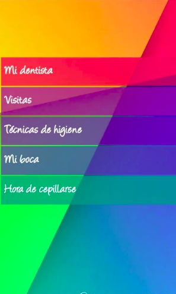

.. -*- coding: utf-8 -*-

.. _rcs_subversion:

Clase 22 - POO 2019
===================
(Fecha: 11 de junio)

:Tarea para Clase 22:
	Ver `Tutorial Qt QWidget <https://www.youtube.com/watch?v=NpwRtpndqA4>`_ de `Videos tutoriales de Qt <https://www.youtube.com/playlist?list=PL54fdmMKYUJvn4dAvziRopztp47tBRNum>`_

	Ver `Tutorial Qt QFile <https://www.youtube.com/watch?v=zDA5FKfRxJA>`_ de `Videos tutoriales de Qt <https://www.youtube.com/playlist?list=PL54fdmMKYUJvn4dAvziRopztp47tBRNum>`_

	Ver `Tutorial Qt QDir <https://www.youtube.com/watch?v=wfabCN1oJpE>`_ de `Videos tutoriales de Qt <https://www.youtube.com/playlist?list=PL54fdmMKYUJvn4dAvziRopztp47tBRNum>`_

	Ver `Tutorial Qt Resource file <https://www.youtube.com/watch?v=u8xKE0zHLsE>`_ de `Videos tutoriales de Qt <https://www.youtube.com/playlist?list=PL54fdmMKYUJvn4dAvziRopztp47tBRNum>`_	

	Tener listos todos los ejercicios que están en GitHub desde la clase 01 hasta la 20

Herencia múltiple
^^^^^^^^^^^^^^^^^

- La clase derivada hereda todos los datos y funciones de todas las clases base
- Puede suceder que en la clases base existan funciones con igual nombre
- Los casos de ambigüedad se solucionan con el nombre completo
- Otra solución sería redefinir en la derivada la función ambigua.

.. code-block:: c	

	#include <QApplication>
	#include <QDebug>

	class ClaseA  {
	public:
	    ClaseA( int a ) : valorA( a )  {  }
	    int verValor()  {  return valorA;  }

	protected:
	    int valorA;
	};

.. code-block:: c	

	class ClaseB  {
	public:
	    ClaseB() : valorB( 20 )  {  }
	    int verValor()  {  return valorB;  }

	protected:
	    int valorB;
	};

.. code-block:: c	

	class ClaseC : public ClaseA, public ClaseB  {
	public:
	    ClaseC( int c ) : ClaseA( c ), ClaseB()  {  }
	    int verValor()  {  return ClaseA::verValor();  }
	};

.. code-block:: c	

	int main( int argc, char ** argv )  {
	    QApplication a( argc, argv );

	    ClaseC c( 10 );
	    qDebug() << c.verValor();  
	    qDebug() << c.ClaseB::verValor();  

	    return 0;
	}

**Ejemplo**

.. code-block:: c	

	class Persona  {
	private:
	    int edad;
	    int x, y;

	public:
	    Persona( int edad = 0 ) : edad( edad ), x( 0 ), y( 0 )  {  }

	    void move( int x, int y )  {
	        this->x = x;
	        this->y = y;
	    }
	};

	class Jugador : public Persona, public QWidget  {
	private:
	    int id;

	public:
	    Jugador() : Persona( 18 ), QWidget(), id( 0 )  {  }

	    void mudarse( int x, int y )  {
	        this->id++;
	        this->Persona::move( x, y );  // Se requiere especificar de esta manera
	    }
	};
	    

**Ejercicio 24**
 
- Crear un proyecto Qt Widget Application con el QWidget principal en la clase Ventana
- Crear una clase Boton que hereda de QWidget
- Redefinir paintEvent en Boton y usar fillRect para dibujarlo de algún color
- Definir el siguiente método en Boton:

.. code-block:: c

	Boton * boton = new Boton;
	boton->colorear( Boton::Azul );

	// Este método recibe como parámetro una enumeración que puede ser:
	// Boton::Azul  Boton::Verde  Boton::Magenta

- Usar QtDesigner para Ventana y Boton. Es decir, Designer Form Class
- Definir la enumeración en Boton
- Abrir el designer de Ventana y agregar 5 botones (objetos de la clase Boton). Promocionarlo
- Que esta Ventana con botones quede lo más parecido a la siguiente imagen:

- Usar para Ventana grid layout, usar espaciadores y usar todos los recursos posibles del QtDesigner
- Dibujar un fondo agradable con paintEvent y drawImage
- Que Boton tenga la señal signal_clic()

**Ejercicio 25** 

- Crear una clase base llamada Instrumento y las clases derivadas Guitarra, Bateria y Teclado.  
- La clase base tiene una función virtual pura llamada ``sonar()``. 
- Defina una función virtual ``verlo()`` que publique la marca del instrumento. Por defecto todos los instrumentos son de la marca Yamaha. 
- Utilice en la función ``main()`` un ``std::vector`` para almacenar punteros a objetos del tipo Instrumento. Instancie 5 objetos y agréguelos al ``std::vector``.
- Publique la marca de cada instrumento recorriendo el vector.
- En las clases derivadas agregue los datos miembro "``int cuerdas``", "``int teclas``" e "``int tambores``" según corresponda. Por defecto, guitarra con 6 cuerdas, teclado con 61 teclas y batería con 5 tambores.
- Haga que la clase ``Teclado`` tenga herencia múltiple, heredando además de una nueva clase ``Electrico``. Todos los equipos del tipo "``Electrico``" tienen por defecto un voltaje de 220 volts. Esta clase deberá tener un destructor que al destruirse publique la leyenda "Desenchufado".
- Al llamar a la función ``sonar()``, se deberá publicar "Guitarra suena...", "Teclado suena..." o "Batería suena..." según corresponda.
- Incluya los métodos ``get`` y ``set`` que crea convenientes.

**Ejercicio 26** 

- Definir dos QWidgets (una clase Login y una clase Ventana).
- El Login validará al usuario contra una base SQLite
- La ventana Ventana sólo mostrará un QPushButton para "Volver" al login.
- Crear solamente un objeto de Ventana y uno solo de Login.

Funciones inline
================

- Cuando decimos que llamamos a una función es porque salta, ejecuta y retorna.
- Una función inline inserta su código.
- Ventaja de ejecutarse más rápidamente.
- Como desventaja tenemos un programa generado más extenso.

.. code-block:: c

	#include <QDebug>
	#include <QApplication>

	inline int calculo( int a, int b )  {
	    return a/2+b;
	}

	int main( int argc, char ** argv )  {
	    QApplication a( argc, argv );

	    int x=2, y=3, z=0;
	    z = calculo( x, y );

	    return 0;
	}

**Funciones miembro inline dentro de clases**

- Un método se declara dentro del cuerpo de la clase y se puede definir dentro o fuera
- Si se declara y define dentro, se denomina función inline. En este caso, no hace falta indicar con inline (está implícito).
- Si se define fuera, deberá indicar inline. De lo contrario será offline.
- Se recomienda usar funciones inline para funciones pequeñas y de uso frecuente.

.. code-block:: c

	#include <QDebug>
	#include <QApplication>

	class ClaseA  {
	private:
	    int x;
	    int y;

	public:
	    ClaseA() : x( 10 ), y( 20 )  {  }
	    int getX()  {  return x;  }     // inline implícito
	    int getY();
	};

	inline int ClaseA::getY()  {
	    return y;
	}

	int main( int argc, char ** argv )  {
	    QApplication a( argc, argv );

	    ClaseA cA;
	    qDebug() << cA.getX();
	    qDebug() << cA.getY();

	    return 0;
	}
	

Declaraciones friend
====================

- Miembros privados no son accesibles para funciones y clases externas
- Podemos usar friend en caso de necesitar acceder
- Se pueden aplicar a clases o métodos
- Inhabilitan el sistema de protección (protected o private)
- La amistad no es transferible

.. code-block:: c
	
	A es amigo de B     B amigo de C     No por eso A es amigo de C

- No se hereda

.. code-block:: c

	A amigo de B     C derivada de B     No por eso A es amigo de C

- No simétrica

.. code-block:: c

	A amigo de B     No por eso B es amigo de A

**Funciones amigas**

.. code-block:: c

	#include <iostream>
	using namespace std;

	class ClaseA  {
	public:
	    ClaseA( int i ) : a( i )  {  }
	    void verA()  {  cout << a << endl;  }

	protected:
	    int a;
	    friend void mostrarA( ClaseA );  // mostrarA es amiga de ClaseA
	};

	void mostrarA( ClaseA cA )  {  // Esta función no pertenece a ClaseA
	    cout << cA.a << endl;      // Pero al ser amiga puede acceder a 'a'
	}

	int main( int argc, char ** argv )  {
	    ClaseA objetoA( 10 );
	    mostrarA( objetoA );
	    objetoA.verA();

	    return 0;
	}
 
**Función amiga en otra clase**

.. code-block:: c

	#include <iostream>
	using namespace std;

	class ClaseA;	// Declaración

	class ClaseB  {
	public:
	    ClaseB( int i ) : b( i )  {  }
		
	    void ver()  {  cout << b << endl;  }
		
	    bool esMayor( ClaseA cA )  {  // Compara
	        return b > cA.a;
	    }
		
	private:
	    int b;
	};

	class ClaseA  {
	public:
	    ClaseA( int i ) : a( i )  {  }
	    void ver()  {  cout << a << endl;  }

	private:
	    friend bool ClaseB::esMayor( ClaseA );
	    int a;
	};

	int main( int argc, char ** argv )  {
	    ClaseA objetoA( 10 );
	    ClaseB objetoB( 2 );

	    objetoA.ver();	
	    objetoB.ver();

	    if ( objetoB.esMayor( objetoA ) )
	        cout << "objetoB > objetoA" << endl;
	    else
	        cout << "objetoB < objetoA" << endl;

	    return 0;
	}
	

Graficación 3D
==============

OpenGL
^^^^^^

- Open Graphics Library
- Especificación que define una API para dibujar en 2D y 3D.
- Los fabricantes de Hardware se basan en esta especificación.
- Funciones para dibujar escenas complejas desde primitivas geométricas.
- Primitivas geométricas simples: Puntos, líneas y triángulos.
- Desarrollada por Silicon Graphics Inc. (1992).
- En 2006 pasa al Grupo Khronos
- Compite con Direct3D de Microsoft
- Direct3D, DirectShow, DirectSound, DirectPlay y otras, son parte de DirectX.

**Para tener en cuenta**

- Las funciones de OpenGL comienzan con ``gl`` y las constantes con ``GL_``
- Existe un sufijo que indica la cantidad de parámetros y el tipo

.. code-block:: c	

	glVertex3f  // 3 parámetros del tipo float

- OpenGL define sus tipos de datos (con ``typedef``)

.. code-block:: c	

	// (typedef se utiliza para asignar un alias a un tipo)

	typedef int GLint
	typedef float GLfloat	

	// s Entero 16-bits short            GLshort
	// i Entero 32-bits int              GLint
	// f Punto flotante 32-bits float    GLfloat
	// d Punto flotante 64-bits double   GLdouble

**Algunos datos**

- 24 cuadros por segundo notamos es la mínima para percibirlo en movimiento fluido.
- Mayor cantidad de imágenes se verá mejor aún.
- 24 fps y 48 fps se utiliza en el cine.
- 60 fps para televisión de alta definición.
- 90 fps se utilizan para realidad virtual.
- Consolas de juegos, algunos monitores ya usan 144 fps.
- Hay bibliotecas que aportan más funcionalidades: GLU, GLUT, GLEW, etc.
- Las primitivas se componen de vértices (puntos en 3D).
- Perspectiva ortonormal: 
 
.. figure:: images/clase19/ortonormal.png

- Punto en 3D. 

.. code-block:: c	

	glVertex3f( 10.0f, 5.0f, 3.0f );

.. figure:: images/clase19/punto.png

Dibujando primitivas
^^^^^^^^^^^^^^^^^^^^

**Puntos GL_POINTS**

.. code-block:: c

	glBegin( GL_POINTS );
	    glVertex3f( 0.0f, 0.0f, 0.0f );
	    glVertex3f( 10.0f, 10.0f, 10.0f );
	glEnd();

- Comienza indicando el tipo de primitiva con ``glBegin()``.
- ``glBegin()`` y ``glEnd()`` actúan como llaves, por ello se acomoda de esa forma.
- Un punto por defecto tiene 1 píxel por 1 píxel
- Podemos setear su tamaño:

.. code-block:: c

	glPointSize( 6.0f ); // tamaño del pixel = 6

**Líneas GL_LINES**

.. code-block:: c

	GLfloat angulo;
	int i;

	glBegin( GL_LINES );
	for ( i = 0; i < 360; i+=3 )  {
	    angulo = ( GLfloat )i * 3.14159f / 180.0f; // grados a radianes
	    glVertex3f( 0.0f, 0.0f, 0.0f );
	    glVertex3f( cos( angulo ), sin( angulo ), 0.0f );
	}
	glEnd();

- Dos puntos hacen una recta.
- Con un número impar de puntos, el último se ignora.

**Líneas consecutivas GL_LINE_STRIP**

- El primer punto y el segundo forman una línea.
- El tercer punto forma una línea con el segundo y así sucesivamente.

**Triángulos GL_TRIANGLES**

.. code-block:: c

	glBegin( GL_TRIANGLES );
	    glVertex3f( 0, -1.0f, -0.5f );
	    glVertex3f( 1.0f, -0.9f, -0.5f );
	    glVertex3f( 0.0f, -0.5f, -0.5f );
	glEnd();

**Color de relleno**

- Modificamos el color con ``glColor3f()`` con valores de 0 a 1.

.. code-block:: c

	glBegin( GL_TRIANGLES );
	    glColor3f( 0, 0, 1 );
	    glVertex3f( 0, -1.0f, -0.5f );
	    glVertex3f( 1.0f, -0.9f, -0.5f );
	    glVertex3f( 0.0f, -0.5f, -0.5f );
	glEnd();

Uso de la Clase QGLWidget
^^^^^^^^^^^^^^^^^^^^^^^^^

- Se requiere lo siguiente en el .pro

.. code-block:: c

	QT += opengl

	win32:LIBS += -lopengl32
	win32:LIBS += -lglu32
	
	unix:LIBS += -lGLU

.. code-block:: c

	#include <QGLWidget>

	class MiOpenGL : public QGLWidget  {
	    Q_OBJECT
		
	public:
	    MiOpenGL();

	protected:
	    void initializeGL();	
	    void resizeGL( int w, int h );
	    void paintGL();
	};
	
	MiOpenGL::MiOpenGL()  {
	
	}

	void MiOpenGL::initializeGL()  { 
	    glClearColor( 0, 0, 0, 0 );
	}

	void MiOpenGL::resizeGL( int w, int h )  {
	    // Porción de ventana donde puede dibujar.
	    glViewport( 0, 0, w, h );

	    // Especifica la matriz actual: matriz de proyección (GL_PROJECTION), matriz de modelo
	    // (GL_MODELVIEW) y matriz de textura (GL_TEXTURE). 
	    glMatrixMode( GL_PROJECTION );

	    // Con esto cargamos en el "tipo" de matriz actual (matriz identidad - como resetear).
	    // Es una matriz 4x4 llena de ceros salvo la diagonal que contiene unos. 
	    glLoadIdentity();

	    // Para delimitar la zona de trabajo en una caja.
	    glOrtho( -1, 1, -1, 1, -1, 1 );

	    // Se vuelve a este tipo de matrices, que afecta a las primitivas geométricas.
	    glMatrixMode( GL_MODELVIEW );
	}

	void MiOpenGL::paintGL()  {
	    // Borra un buffer.
	    glClear( GL_COLOR_BUFFER_BIT );

	    //  Carga la matriz identidad.
	    glLoadIdentity();

	    // Acá se inserta el código para dibujar 

	    // Volcamos en pantalla lo que se creó en memoria.
	    glFlush();
	}

**Ejercicio 27**

- Dibujar un triángulo en el plano ``z=-50``
- Utilizar el teclado para que al presionar la tecla C, el triángulo cambie de color.

